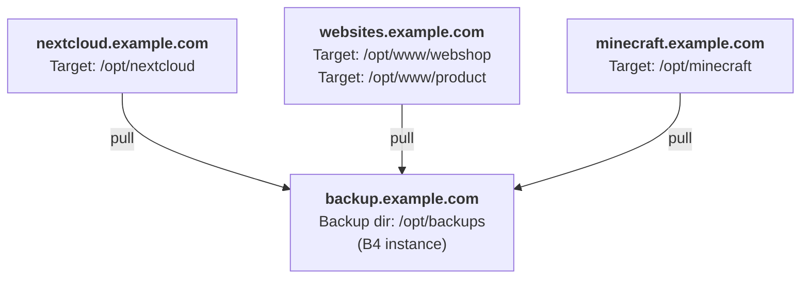
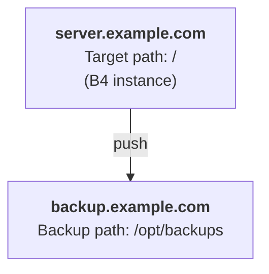

# Examples

Here we collect a list of examples.
These examples are part of a scenario or use-case how B4 Backup could be used to create and restore your backups.

## Pull backup

### Overview

We got three servers with different target locations to backup. B4 is installed on `backup.example.com` and is pulling the backups via SSH every day using a cronjob.



### Config files

!!! example "b4_backup.yml"
    ```yaml
    ---
    backup_targets:
      _default:  # (5)!
        destination: /opt/backups
        src_retention:
          auto:
            all: "7days"
        dst_retention:  # (1)!
          auto:
            1day: 1month  # (2)!
            1week: 1year
            1month: forever

      nextcloud.example.com:
        source: ssh://root@nextcloud.example.com/opt/nextcloud

      websites.example.com/webshop:
        source: ssh://root@websites.example.com/opt/www/webshop

      websites.example.com/product:
        source: ssh://root@websites.example.com/opt/www/product

      minecraft.example.com:
        source: ssh://root@minecraft.example.com/opt/minecraft

    timezone: utc
    default_targets:
      - nextcloud.example.com
      - websites.example.com  # (4)!
      - minecraft.example.com
    logging:
      loggers:
        root:
          level: DEBUG  # (3)!
    ```

    1. Retention rules are describing how long backups should be kept. Beside of just defining a lifetime, it's also possible to define a gradually decreasing density.
    2. This ruleset means that daily updates are kept for a month, then the density will be reduced to weekly updates which are kept for a year and so on.
    3. The logging section is a python logging.config.dictConfig which provides a powerful logging system. More info can be found in the official python documentation. <https://docs.python.org/3/library/logging.config.html#dictionary-schema-details>
    4. If you have multiple targets on the same server, you can define them in a single entry, because we have separated them by a slash. The Target name is just an arbitrary name.
    5. The `_default` keyword has a special meaning. If you omit values in another target, this value will be used. The `_default` keyword is also valid in `src_retention`, `dst_retention` and `subvolume_rules`


!!! example "Daily Cronjob"

    ```cron title="/etc/cron.d/b4_backup_daily"
    0 12 * * * root    b4 backup --name auto
    ```

### Example commands

__Backup all targets defined in `default_targets` and use the retention ruleset `auto`:__

```bash
b4 backup --name auto
```

A backup procedure contains the following stages:

- Create a snapshot on the source server<br/>
  Source snapshots are located at `<btrfs_mount_point\>/.b4_backup`
- Get nearest parent snapshot which is available on source and destination side if present
- If yes: Send snapshots incrementally to the destination
- Apply retention rules on source and destination to delete old snapshots

__Backup `nextcloud.example.com` and use the default retention ruleset `manual`:__

```bash
b4 backup --target nextcloud.example.com
```

__Restore the snapshot `2023-08-28-13-37_manual` of target `nextcloud.example.com` using the default strategy (safe):__

```bash
b4 restore 2023-08-28-13-37_manual --target nextcloud.example.com
```

This restore strategy only copies the snapshot back to the source snapshot location without touching the actual data.
That is a good option, if you want to perform the actual restore yourself, or you only want to access old files without replacing the whole target.

__Restore the same snapshot using the REPLACE strategy:__

```bash
b4 restore 2023-08-28-13-37_manual --target nextcloud.example.com --strategy replace
```

The replace strategy moves the target subvolume away and replaces it with the selected snapshot. The Nextcloud instance is being shut off before that. This action can be undone by the following command.

```bash
b4 restore REPLACE --target nextcloud.example.com --strategy replace
```

## Push backup

### Overview

Here B4 Backup is installed on the server you want to backup and the snapshots are pushed to a backup server.



### Config files

!!! example "b4_backup.yml"
    ```yaml
    ---
    backup_targets:
      _default:
        destination: ssh://nextcloud@backup.example.com/home/nextcloud/backups
        src_retention:
          auto:
            all: "3"
        dst_retention:
          auto:
            1day: 1month
            1week: 1year
            1month: forever

      nextcloud.example.com:
        source: /opt/nextcloud

    timezone: local
    default_targets:
      - nextcloud.example.com
    logging:
      loggers:
        root:
          level: INFO
    ```

### Example commands

__Backup target and use the retention ruleset `auto`:__

```bash
b4 backup --name auto
```

## Local to Local

### Overview

In this scenario we are using B4 Backup to backup a local PC using an external hard drive. B4 Backup is installed on the PC and got a cronjob, which creates a snapshot of the full system every day, similar how tools like timeshift are doing it on a daily basis and keep it on the local system. The hard drive is encrypted using luks.

If we eventually connect the external hard drive to the PC, we can run a sync command to send all unsended snapshots to the external hard drive and clean up the accumulated local ones.

The default restore strategy is a `REPLACE` is a "soft replace", which means the active and mounted subvolume will be moved away instead of being deleted directly. This way we can restore the system while it's live and switch to the restored state by rebooting the system. The old moved subvolumes are deleted after a certain amount of time which is defined in the configuration.

### Config files

!!! tip "Create encrypted btrfs hard drive"
    ```bash
    # In this case /dev/sdb is our external hard drive

    # Fill partition with random noise to improve security (optional)
    sudo dd if=/dev/urandom of=/dev/sdb bs=512k

    sudo cryptsetup luksFormat /dev/sdb
    sudo cryptsetup open /dev/sdb crypt_backup
    sudo mkfs.btrfs -L backups /dev/mapper/crypt_backup
    ```

!!! example "b4_backup.yml"

    ```yaml
    ---
    backup_targets:
      mainpc.local:
        destination: /media/username/backups
        source: /btrfs_root  # (4)!
        restore_strategy: REPLACE
        replaced_target_ttl: 3days
        src_snapshot_dir: .b4_backup
        if_dst_dir_not_found: FAIL  # (5)!
        src_retention:
          auto:
            all: "7days"
        dst_retention:
          auto:
            1day: 1month
            1week: 1year
            1month: forever
        subvolume_rules:  # (1)!
          /home/username/.cache:  # (3)!
            backup_strategy: SOURCE_ONLY
            fallback_strategy: NEW
          /home/username/.steam:
            backup_strategy: IGNORE
            fallback_strategy: NEW
          /home/username/.local/share/Trash:
            backup_strategy: IGNORE
            fallback_strategy: NEW
          .local/share/containers/storage:
            backup_strategy: IGNORE
          docker/btrfs/subvolumes:
            backup_strategy: IGNORE
          .b4_backup: # (2)!
            backup_strategy: IGNORE
    default_targets:
      - mainpc.local
    timezone: local
    ```

    1. Like the property name suggest, all items need to be a btrfs subvolume to be able to be matched ignored
    2. The default location of source snapshots (The point you want to backup) created by B4 Backup is `<btrfs_mount_point>/.b4_backup`. But because we want to backup at the btrfs mount point itself, we need to make sure doesn't start to recursively snapshot the snapshot location. That's why we need to explicitly exclude it here.
    3. Directories that often change, while they doesn't provide any value as a backup, shouldn't be copied to the destination. Caches are a perfect example for that. This way we can even restore the cache, as long as the snapshot is still present on source side.
    4. The btrfs_root is the true root of the btrfs subvolume, which is mounted to that point. The system rootfs is just a subvolume inside that.
    5. The default behavior of b4 is to create missing directories. But the destination dir can be just unmounted, so it need to throw an error, if that is the case.

!!! example "fstab"
    ```fstab title="/etc/fstab"
    TODO: Add fstab example
    ```

!!! example "Cronjob: b4_backup_auto_snapshot"
    ```cron title="/etc/cron.d/b4_backup_daily_snapshot"
    0 12 * * * root    b4 backup --name auto --offline
    ```

### Example commands

If you mount your external drive and want to send all snapshots created so far to the external drive, you can sync them with the following command:

```bash
b4 sync
```
